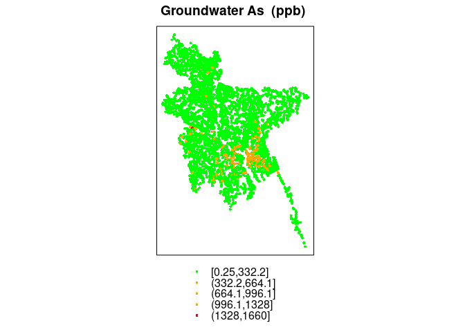
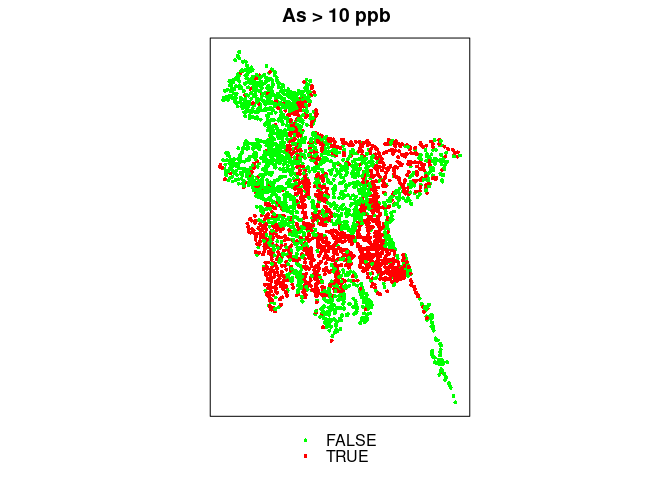
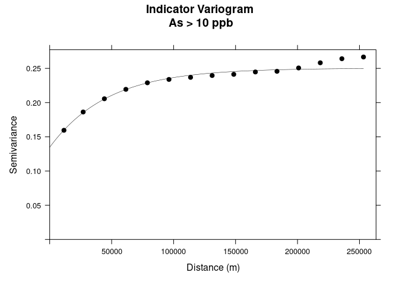
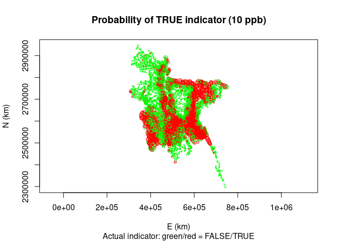
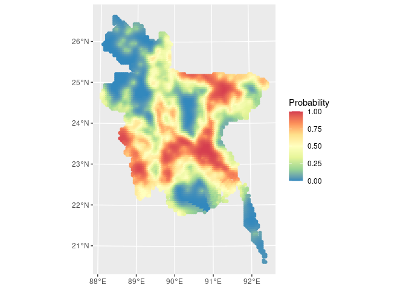
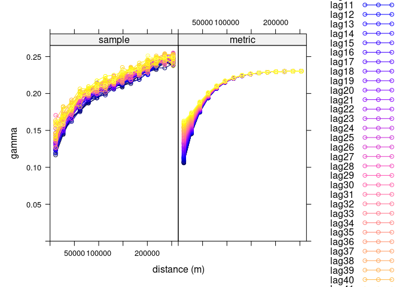
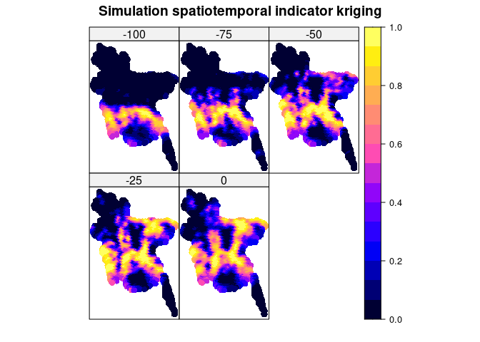

Kriging_st_simulation
================
Filippo
2025-05-21

## Description

Here I try to implement a spatiotempral indicator kriging using the
example found here for a standard indicator kriging:

<https://zia207.github.io/geospatial-r-github.io/indicator-kriging.html>

## Load data

``` r
suppressPackageStartupMessages({
  library(tidyverse)
  library(GenomicRanges)
  library(rtracklayer)
  library(here)
  library(readr)
  library(sf)
  library(rnaturalearth)
  library(ggbio)
  library(plyranges)
  library(stars)
  library(igraph)
  library(sfnetworks)
  library(slendr)
  library(dismo)
  library(sp)
  library(terra)
  library(gstat)
  library(spacetime)
  library(raster)
  library(plyr)
})

source(here::here("utils.R"))
```

``` r
dataFolder <- "data/"
df<-read.csv(paste0(dataFolder,"bgs_geochemical.csv"), header= TRUE) 
grid<-read.csv(paste0(dataFolder,"bd_grid.csv"), header= TRUE) 
bd<-shapefile(paste0(dataFolder,"BD_Banladesh_BUTM.shp")) 
```

``` r
summary(df$As)
```

    ##    Min. 1st Qu.  Median    Mean 3rd Qu.    Max. 
    ##    0.25    0.25    3.90   55.17   49.98 1660.00

``` r
##  define coordinates
xy <- df[,c(4,5)]
# Convert to spatial point
SPDF <- SpatialPointsDataFrame(coords = xy, data=df) 
# Define projection
proj4string(SPDF) = CRS("+proj=longlat +ellps=WGS84")  # WGS 84
# Change projection 
BUTM<-proj4string(bd)              # extract projection information
SPDF.PROJ<- spTransform(SPDF,        # Input SPDF
                          BUTM)  
```

``` r
# convert to a data-frame
point.df<-as.data.frame(SPDF.PROJ)
# Rename (last two column)
colnames(point.df)[35] <- "x"
colnames(point.df)[36] <- "y"
mf<-point.df[,c(35:36,7,15,23)]
head(mf)
```

    ##          x       y WELL_TYPE  As    Fe
    ## 1 509574.3 2474006       DTW 0.5 0.103
    ## 2 439962.9 2647931       STW 0.5 0.087
    ## 3 662328.1 2718502       STW 0.5  1.37
    ## 4 619708.4 2631583       STW 0.5 0.128
    ## 5 454332.2 2522667       DTW 0.5 0.019
    ## 6 438852.0 2576967       STW 0.5 0.042

Unlike the tutorial, I will only focus on arsenic values \>10

``` r
ik.10<-mf$As > 10    # threshold 10 ppb
```

``` r
mf$VAR <- ik.10
# rename
ik.df <- mf
```

``` r
coordinates(ik.df)=~x+y
# Add projection, important especially for variogramST
proj4string(ik.df) <- proj4string(bd)
# This are supposed to be the sampled points
coordinates(grid) = ~x+y
proj4string(grid) <- proj4string(bd)
```

``` r
spplot(ik.df, zcol = "As", col.regions = c("green", "orange", "red"), cex=.5,
       main = "Groundwater As  (ppb)")
```

<!-- -->

``` r
p1 <- spplot(ik.df, zcol="VAR", col.regions = c("green", "red"), cex=.5,
       main = "As > 10 ppb")
p1
```

<!-- -->

``` r
# REMOVE DUPLICATES
ik.df <- ik.df[-zerodist(ik.df)[,1],] 
# Variogram
v10<-variogram(VAR~ 1, data = ik.df)
# Intial parameter set by eye esitmation
m10<-vgm(0.15,"Exp",40000,0.05)
# least square fit
m.f.10<-fit.variogram(v10, m10)
m.f.10
```

    ##   model     psill    range
    ## 1   Nug 0.1346799     0.00
    ## 2   Exp 0.1155823 46860.32

Plot variogram

``` r
v1<-plot(v10, pl=F, 
     model=m.f.10,
     col="black", 
     cex=0.9, 
     lwd=0.5,
     lty=1,
     pch=19,
     main="Indicator Variogram\n As > 10 ppb",
     xlab="Distance (m)",
     ylab="Semivariance")
v1
```

<!-- -->
Cross-validation LOO, not sure the reason. Yeah it should be just
another way of doing it.

It’s just a way of predicting the probaility on known point leaving that
point out, without using a grid of non sampled point (see plot down).

``` r
cv.10 <- krige.cv(VAR ~ 1, loc = ik.df, model = m.f.10, nfold=5)
cv.10$var1.pred <- pmin(1, cv.10$var1.pred)
cv.10$var1.pred <- pmax(0, cv.10$var1.pred)
```

The color of the circles correspond to the actual label, the size to the
probability of being TRUE.

``` r
plot(coordinates(cv.10), asp = 1, pch=21, col = ifelse(cv.10$observed,
 "red", "green"), cex = 0.2 + 1 * cv.10$var1.pred,
 xlab = "E (km)", ylab = "N (km)", main = "Probability of TRUE indicator (10 ppb)",
 sub = "Actual indicator: green/red = FALSE/TRUE")
```

<!-- -->

## IK Prediction at grid location

Same as before, but this time we predict the probability for the point
in the grid.

``` r
# grid has 5339 points
grid
```

    ## class       : SpatialPointsDataFrame 
    ## features    : 5339 
    ## extent      : 301021.7, 751021.7, 2279493, 2944493  (xmin, xmax, ymin, ymax)
    ## crs         : +proj=tmerc +lat_0=0 +lon_0=90 +k=0.9996 +x_0=500000 +y_0=0 +datum=WGS84 +units=m +no_defs 
    ## variables   : 1
    ## names       :   ID 
    ## min values  :    1 
    ## max values  : 6272

``` r
ik.grid.10<-krige(VAR~ 1, nmax=50,
              loc=ik.df,        # Data frame
              newdata=grid,     # Prediction location
              model = m.f.10)
```

    ## [using ordinary kriging]

Model does not know we are working with probabilities, so we need to
limit it between 0 and 1.

``` r
ik.grid.10$var1.pred <- pmin(1, ik.grid.10$var1.pred)
ik.grid.10$var1.pred <- pmax(0, ik.grid.10$var1.pred)
```

``` r
summary(ik.grid.10)
```

    ## Object of class SpatialPointsDataFrame
    ## Coordinates:
    ##         min       max
    ## x  301021.7  751021.7
    ## y 2279492.7 2944492.7
    ## Is projected: TRUE 
    ## proj4string :
    ## [+proj=tmerc +lat_0=0 +lon_0=90 +k=0.9996 +x_0=500000 +y_0=0
    ## +datum=WGS84 +units=m +no_defs]
    ## Number of points: 5339
    ## Data attributes:
    ##    var1.pred          var1.var     
    ##  Min.   :0.00000   Min.   :0.1451  
    ##  1st Qu.:0.09777   1st Qu.:0.1541  
    ##  Median :0.36867   Median :0.1564  
    ##  Mean   :0.40764   Mean   :0.1601  
    ##  3rd Qu.:0.68404   3rd Qu.:0.1604  
    ##  Max.   :1.00000   Max.   :0.2436

Yup, it is bounded.

## Plot

``` r
ggplot()+geom_sf(data=st_as_sf(ik.grid.10), mapping = aes(color=var1.pred))+ scale_color_distiller(name = "Probability", palette = "Spectral")
```

<!-- -->

## Spatiotemporal indicator kriging

Now I try to do the same, but in a spatiotemporal way. To keep it
simple, I try to introduce the positive points above a certain latitude
over time (as if they spread from South to North), to simulate a sort of
migration. I will have to add a time variable to the original dataframe.

``` r
# Add time column
# First I assign a time to all the points, sampled from 0 to 100
my.df <- ik.df

set.seed(2001)
my.df$TIME <- sample(0:100, size = nrow(my.df), replace = TRUE)
# Now I will prevent points above a certain latitude and before a certain time to have VAR=1
my.df.data <- my.df %>% as.data.frame() %>% mutate(VARNEW = case_when(TIME>80 & y>26e5 & VAR==1 ~ 0, TIME>50 & y>27e5 & VAR==1 ~ 0, TIME>20 & y>28e5 & VAR==1 ~ 0, .default = VAR))

my.df@data <- my.df.data
```

Now I can try to run a spatiotemporal indicator kriging. We will need to
convert the time into a POSIXlt format so that everything works fine and
then build a 3D grid of the points (grid) that we want to interpolate
with the third dimension being time.

``` r
oldesttime <- -Inf
youngesttime <- 0
# This way years are second and I subtratc them to the origin
# Origin is at 190 1 1 and 1 minute
dataTM <- as.POSIXlt(-my.df$TIME, origin="1970-01-01")
oldestdata <- max( oldesttime, min(-my.df$TIME) )
# This correspod to the oldest in POISXlt time
oldestdataTM <- as.POSIXlt(oldestdata, origin="1970-01-01")
youngestdata <- min( youngesttime, max(-my.df$TIME) )
youngestdataTM <- as.POSIXlt(youngestdata, origin="1970-01-01")
# Create 5 timepoints, every 20 years
numtimepoints=5
# Create temporal grid
if(!is.na(numtimepoints)){
    rawtimegrid <- round(seq(oldestdata,youngestdata,length.out=numtimepoints))
    tm.grid <- seq(as.POSIXct(oldestdataTM),as.POSIXct(youngestdataTM),length.out=numtimepoints)
} else {
       rawtimegrid <- sort(unique(-data.UTM$TIME))
       tm.grid <- as.POSIXct(rawtimegrid, origin="1970-01-01")
}

# Create spatiotemporal grid
# basically add a third dimension that it is time
grid.ST <- STF(grid, tm.grid)
```

Now that I defined the grid, we can compute the st variogram to then do
kriging.

``` r
# Get the variable of intereset
dataDF <- data.frame(my.df$VARNEW)
colnames(dataDF) <- "MYVAR"
dataSP <- SpatialPoints(my.df@coords)
proj4string(dataSP) <- proj4string(bd)
# dataSP is just the coordinates of the sampled points
# dataTM the time in the right format
# dataDF the label, 0 or 1
timeDF <- STIDF(dataSP,dataTM,data=dataDF)
```

Now I can compute the variogram.

``` r
file2save <- "variogram.rds"
if(!file.exists(file2save)){
  # I try 1:50 for time lags and set time in sec, that 1 sec = 1 year
  var <- variogramST(MYVAR~1,data=timeDF,tunit="secs",assumeRegular=F,na.omit=T,tlags=1:50)
  saveRDS(var, file2save)
}else{
  var <- readRDS(file2save)
}
```

Define model and select it, Fernando’s code.

``` r
m10<-vgm(0.15,"Exp",40000,0.05)
# least square fit
anistart <- 1
aniend <- 500
anistep <- 10
pars.l <- c(sill.s = 0, range.s = 0, nugget.s = 0,sill.t = 0, range.t = 0, nugget.t = 0,sill.st = 0, range.st = 0, nugget.st = 0, anis = 0)
#pars.u <- c(sill.s = 1e7, range.s = 1e7, nugget.s = 1e7,sill.t = 1e7, range.t = 1e7, nugget.t = 1e7,sill.st = 1e7, range.st = 1e7, nugget.st = 1e7,anis = 1e7)
finalVgmMSE <- Inf
finalVgm <- NULL
for( anisotropy in seq(anistart,aniend,anistep)){
    try( {
    metric <- vgmST("metric", joint = m10, stAni=anisotropy)
    # prodSumModel <- vgmST("productSum",space = vgm(1, "Exp", 150, 0.5),time = vgm(1, "Exp", 5, 0.5),k = 50) 
    metric_Vgm <- fit.StVariogram(var, metric, method="L-BFGS-B", tunit="secs")
    mse <- attr(metric_Vgm,"MSE")
    #print(paste("Anisotropy: ",anisotropy,"; MSE: ",mse,sep=""))
    if(mse < finalVgmMSE){
        finalVgmMSE <- mse
        finalVgm <- metric_Vgm
    }
    }, silent = TRUE)
}
```

## Plot variogram and fitted model

``` r
plot(var, finalVgm, map=F, all=T)
```

<!-- -->

## Predict grid

Kriging predictions

``` r
file_pred <- "pred_bd.rds"
if(!file.exists(file_pred)){
  pred<-krigeST(MYVAR~ 1, nmax=50,
              data = timeDF,        # Data frame
              newdata=grid.ST,     # Prediction location
              modelList = finalVgm)
  saveRDS(pred, file_pred)
}else{
  pred <- readRDS(file_pred)
}
```

``` r
# Bound values between 0-1 (the algorithm does not know the domain)
attributes(pred)$data <- BoundKriging(attributes(pred)$data, 0, 1)
stplot(pred, colorkey=TRUE, names.attr=rawtimegrid, main = "Simulation spatiotemporal indicator kriging")
```

<!-- -->
